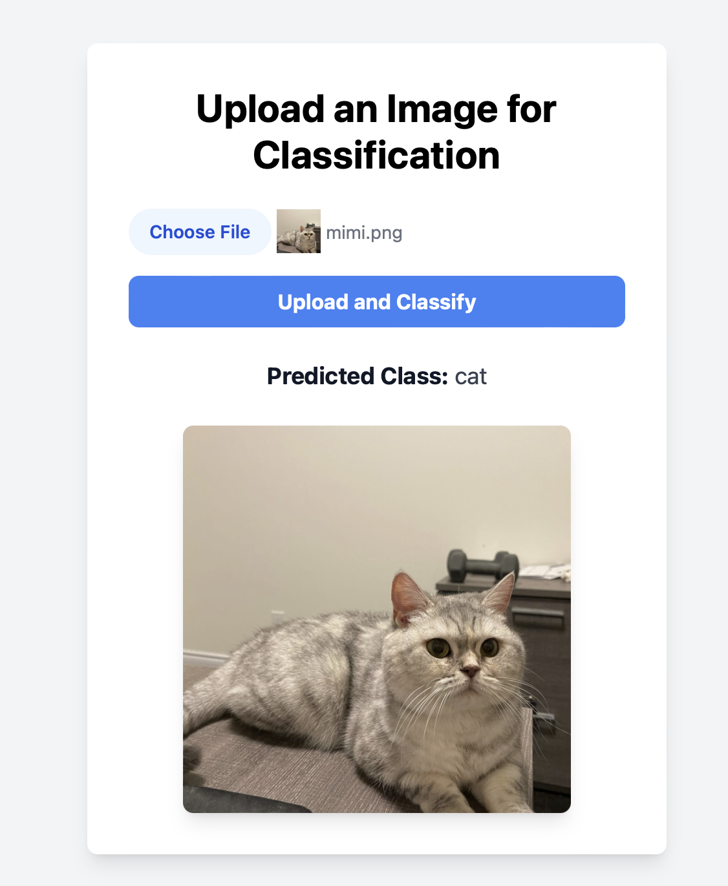

# Image Classification with Kubernetes

This project demonstrates an image classification application by training CNN model with the cifar-10 datasets and deployed on Kubernetes with GKE on GCP. You can also deploy locally with Minikube or on AWS. The backend is built with Django, and the frontend uses HTML and Tailwind CSS.

Check out the dataset here: [CIFAR-10](https://www.cs.toronto.edu/~kriz/cifar.html). You could also use the larger CIFAR-100 datasets.

## Screenshots

### Cat


### Dog


## Setup

### Prerequisites

- Docker
- Kubernetes
- Python
- Google Cloud SDK (for GKE)

### Installation

1. **Clone the repository**:

    ```bash
    git clone https://github.com/heming277/image-classification-k8s.git
    cd image-classification-k8s
    ```

2. **Create and activate a virtual environment**:

    ```bash
    python -m venv venv
    source venv/bin/activate 
    ```

3. **Install dependencies**:

    ```bash
    pip install -r requirements.txt
    ```

4. **Train the model** (or use the one I trained):

    ```bash
    cd image_classification 
    python manage.py train
    ```

    ```text
    Starting model training...
    Files already downloaded and verified
    Epoch 1, Loss: 1.6794797382354736
    Epoch 2, Loss: 1.3967218477249146
    Epoch 3, Loss: 1.2865478444099425
    Epoch 4, Loss: 1.1995188309669496
    Epoch 5, Loss: 1.1316233855247497
    Epoch 6, Loss: 1.072108512020111
    Epoch 7, Loss: 1.0181676738739014
    Epoch 8, Loss: 0.9742260187149048
    Epoch 9, Loss: 0.9307728042602539
    Epoch 10, Loss: 0.8938449895858764
    Finished Training
    Model training completed.
    ```

    For example, you see after 10 epochs the loss has reduced from 1.68 to 0.89.

5. **To Run Locally** (optional):

    ```bash
    python manage.py runserver
    ```

### Docker and Kubernetes

1. **Build Docker image**:

    ```bash
    docker build -t gcr.io/your-project-id/image-classification:latest .
    ```

2. **Push Docker image to Google Artifact Registry**:

    ```bash
    docker push gcr.io/your-project-id/image-classification:latest
    ```

3. **Create a GKE Cluster**:

    ```bash
    gcloud container clusters create image-classification-cluster --zone us-central1-a
    gcloud container clusters get-credentials image-classification-cluster --zone us-central1-a
    ```

4. **Deploy to Kubernetes**:

    ```bash
    kubectl apply -f deployment.yaml
    kubectl apply -f service.yaml
    ```

5. **Verify the Deployment**:

    ```bash
    # Check the status of your pods
    kubectl get pods

    # Check the status of your services
    kubectl get services
    ```

    Use the external IP address to access the app.

## Usage

- **Upload an image** on the web interface to classify it.

## License

This project is licensed under the MIT License.
